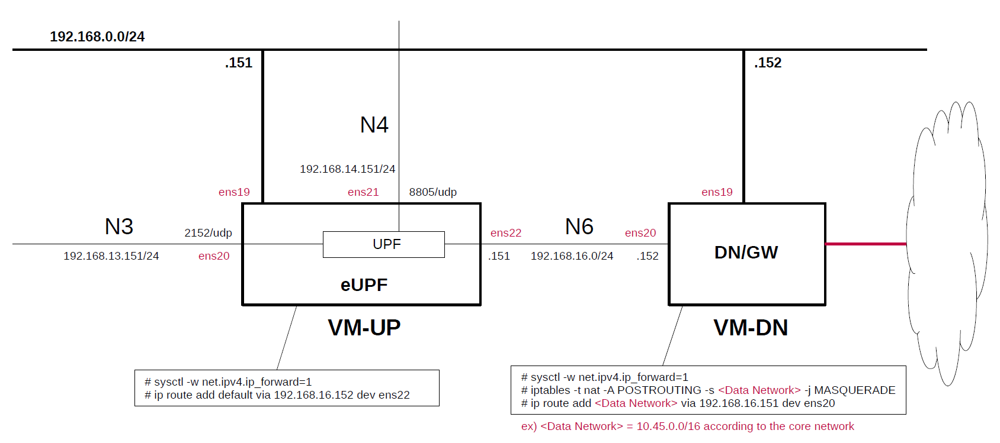

# Install eUPF(eBPF/XDP UPF) on Host
This briefly describes the steps and configuration to build and install [eUPF](https://github.com/edgecomllc/eupf).
There are installation instructions in the eUPF repository, but I would like to write down the steps for actually installing it.
**It is intended to be prepared for use with [Open5GS](https://github.com/open5gs/open5gs) and [free5GC](https://github.com/free5gc/free5gc).**

---

### [Sample Configurations and Miscellaneous for Mobile Network](https://github.com/s5uishida/sample_config_misc_for_mobile_network)

---

<a id="toc"></a>

## Table of Contents

- [Simple Overview of eUPF and Data Network Gateway](#overview)
- [Build eUPF on VM-UP](#build)
  - [Install required packages](#install_packages)
  - [Install Golang and Setting](#install_golang)
  - [Install the Swag command line tool for Golang](#install_swag)
  - [Clone eUPF](#clone)
  - [Run the code generators](#generate_codes)
  - [Build eUPF](#build_1)
- [Setup eUPF on VM-UP](#setup_up)
  - [Create configuration file](#conf)
- [Run eUPF on VM-UP](#run)
- [Setup Data Network Gateway on VM-DN](#setup_dn)
- [How to capture packets on XDP ports](#pcap)
- [Sample Configurations](#sample_conf)
  - [For 5G](#5g_conf)
  - [For 4G](#4g_conf)
- [Changelog (summary)](#changelog)

---

<a id="overview"></a>

## Simple Overview of eUPF and Data Network Gateway

This describes a simple configuration of eUPF and Data Network Gateway, focusing on U-Plane.
**Note that this configuration is implemented with Proxmox VE VMs.**

The following minimum configuration was set as a condition.
- One UPF and Data Network Gateway

The built simulation environment is as follows.

</img>

The eBPF/XDP UPF used is as follows.
- eBPF/XDP UPF - eUPF v0.7.1 (2025.06.16) - https://github.com/edgecomllc/eupf

Each VMs are as follows.  
| VM | SW & Role | IP address | OS | CPU<br>(Min) | Mem<br>(Min) | HDD<br>(Min) |
| --- | --- | --- | --- | --- | --- | --- |
| VM-UP | eUPF U-Plane | 192.168.0.151/24 | Ubuntu 24.04 | 1 | 2GB | 10GB |
| VM-DN | Data Network Gateway  | 192.168.0.152/24 | Ubuntu 24.04 | 1 | 1GB | 10GB |

The network interfaces of each VM are as follows.
| VM | Device | Model | Linux Bridge | IP address | Interface | XDP |
| --- | --- | --- | --- | --- | --- | --- |
| VM-UP | ~~ens18~~ | ~~VirtIO~~ | ~~vmbr1~~ | ~~10.0.0.151/24~~ | ~~(NAPT NW)~~ ***down*** | -- |
| | ens19 | VirtIO | mgbr0 | 192.168.0.151/24 | (Mgmt NW) | -- |
| | ens20 | VirtIO | vmbr3 | 192.168.13.151/24 | N3 | x |
| | ens21 | VirtIO | vmbr4 | 192.168.14.151/24 | N4 | -- |
| | ens22 | VirtIO | vmbr6 | 192.168.16.151/24 | N6 | x |
| VM-DN | ens18 | VirtIO | vmbr1 | 10.0.0.152/24 | (NAPT NW) | -- |
| | ens19 | VirtIO | mgbr0 | 192.168.0.152/24 | (Mgmt NW) | -- |
| | ens20 | VirtIO | vmbr6 | 192.168.16.152/24 | N6 ***(default GW for VM-UP)*** | -- |

Linux Bridges of Proxmox VE are as follows.
| Linux Bridge | Network CIDR | Interface |
| --- | --- | --- |
| vmbr1 | 10.0.0.0/24 | NAPT NW |
| mgbr0 | 192.168.0.0/24 | Mgmt NW |
| vmbr3 | 192.168.13.0/24 | N3 |
| vmbr4 | 192.168.14.0/24 | N4 |
| vmbr6 | 192.168.16.0/24 | N6 |

<a id="build"></a>

## Build eUPF on VM-UP

Please refer to the following for building eUPF.
- eUPF v0.7.1 (2025.06.16) - https://github.com/edgecomllc/eupf

<a id="install_packages"></a>

### Install required packages

```
# apt install git clang llvm gcc-multilib libbpf-dev
```
If you want to use `xdpdump` command, install `xdp-tools` package.
```
# apt install xdp-tools
```

<a id="install_golang"></a>

### Install Golang and Setting

```
# wget https://go.dev/dl/go1.24.2.linux-amd64.tar.gz
# tar -C /usr/local -zxvf go1.24.2.linux-amd64.tar.gz
# mkdir -p ~/go/{bin,pkg,src}
# echo 'export GOPATH=$HOME/go' >> ~/.bashrc
# echo 'export GOROOT=/usr/local/go' >> ~/.bashrc
# echo 'export PATH=$PATH:$GOPATH/bin:$GOROOT/bin' >> ~/.bashrc
# echo 'export GO111MODULE=auto' >> ~/.bashrc
# source ~/.bashrc
```

<a id="install_swag"></a>

### Install the Swag command line tool for Golang

```
# go install github.com/swaggo/swag/cmd/swag@v1.8.12
```

<a id="clone"></a>

### Clone eUPF

```
# git clone https://github.com/edgecomllc/eupf.git
# cd eupf
```

<a id="generate_codes"></a>

### Run the code generators

```
# go generate -v ./cmd/...
```
If you want to output kernel logs for debugging, add the following option.
```
# BPF_CFLAGS="-DENABLE_LOG" go generate -v ./cmd/...
```
In that case, to see debug log from eBPF programs:
```
# cat /sys/kernel/debug/tracing/trace_pipe
```
**Note. If outputting kernel logs for debugging, eUPF performance will decrease significantly. So it is usually recommended to build a binary that does not output kernel logs.**

<a id="build_1"></a>

### Build eUPF

```
# go build -v -o bin/eupf ./cmd/
```

<a id="setup_up"></a>

## Setup eUPF on VM-UP

Please refer to the following for setup eUPF.
- eUPF v0.7.1 (2025.06.16) - https://github.com/edgecomllc/eupf/blob/main/docs/Configuration.md

First, uncomment the next line in the `/etc/sysctl.conf` file and reflect it in the OS.
```
net.ipv4.ip_forward=1
```
```
# sysctl -p
```
Next, down the default interface`ens18` of the VM-UP and set the VM-DN IP address to default GW on the N6 interface`ens22`.
```
# ip link set dev ens18 down
# ip route add default via 192.168.16.152 dev ens22
```

<a id="conf"></a>

### Create configuration file

Create `/root/eupf` directory and put the configuration file there.

- `/root/eupf/config.yml`

```yaml
interface_name: [ens20, ens22]
xdp_attach_mode: native
api_address: :8080
pfcp_address: 192.168.14.151:8805
pfcp_node_id: 192.168.14.151
pfcp_remote_node: 192.168.14.111
association_setup_timeout: 5
metrics_address: :9090
n3_address: 192.168.13.151
n9_address: 192.168.13.151
gtp_peer:
gtp_echo_interval: 10
qer_map_size: 1024
far_map_size: 1024
urr_map_size: 1024
pdr_map_size: 1024
max_sessions: 65535
heartbeat_retries: 3
heartbeat_interval: 5
heartbeat_timeout: 5
logging_level: info
feature_ueip: true
feature_ftup: true
ueip_pool: 10.45.0.0/16
teid_pool: 65535
```
If `xdp_attach_mode` is `generic`(Kernel-level implementation), the performance will not be improved.
`native`(Driver-level implementation) or `offload`(NIC-level implementation) will be better.
For reference, a list of drivers that support XDP can be found [here](https://github.com/iovisor/bcc/blob/master/docs/kernel-versions.md#xdp).

<a id="run"></a>

## Run eUPF on VM-UP

```
# cd /root/eupf
# bin/eupf --config config.yml
2025/06/16 23:44:50 Startup config: map[api_address::8080 association_setup_timeout:5 far_map_size:1024 feature_ftup:true feature_ueip:true gtp_echo_interval:10 gtp_peer:[] heartbeat_interval:5 heartbeat_retries:3 heartbeat_timeout:5 interface_name:[ens20 ens22] logging_level:info max_sessions:65535 metrics_address::9090 n3_address:192.168.13.151 n9_address:192.168.13.151 pdr_map_size:1024 pfcp_address:192.168.14.151:8805 pfcp_node_id:192.168.14.151 pfcp_remote_node:192.168.14.111 qer_map_size:1024 teid_pool:65535 ueip_pool:10.45.0.0/16 urr_map_size:1024 xdp_attach_mode:native]
2025/06/16 23:44:50 Apply eUPF config: {InterfaceName:[ens20 ens22] XDPAttachMode:native ApiAddress::8080 PfcpAddress:192.168.14.151:8805 PfcpNodeId:192.168.14.151 PfcpRemoteNode:[192.168.14.111] AssociationSetupTimeout:5 MetricsAddress::9090 N3Address:192.168.13.151 N9Address:192.168.13.151 GtpPeer:[] GtpEchoInterval:10 QerMapSize:1024 FarMapSize:1024 UrrMapSize:1024 PdrMapSize:1024 MaxSessions:65535 HeartbeatRetries:3 HeartbeatInterval:5 HeartbeatTimeout:5 LoggingLevel:info UEIPPool:10.45.0.0/16 FTEIDPool:65535 FeatureUEIP:true FeatureFTUP:true}
2025/06/16 23:44:50 INF Attached XDP program to iface "ens20" (index 4)
2025/06/16 23:44:50 INF Attached XDP program to iface "ens22" (index 6)
2025/06/16 23:44:50 INF Initialize resources: UEIP pool (CIDR: "10.45.0.0/16"), TEID pool (size: 65535)
2025/06/16 23:44:50 INF Starting PFCP connection: 192.168.14.151:8805 with Node ID: 192.168.14.151, N3 address: 192.168.13.151, N9 address: 192.168.13.151
[GIN-debug] [WARNING] Creating an Engine instance with the Logger and Recovery middleware already attached.

[GIN-debug] [WARNING] Running in "debug" mode. Switch to "release" mode in production.
 - using env:   export GIN_MODE=release
 - using code:  gin.SetMode(gin.ReleaseMode)

[GIN-debug] GET    /api/v1/health            --> github.com/edgecomllc/eupf/cmd/api/rest.(*ApiHandler).InitRoutes.func1 (4 handlers)
[GIN-debug] GET    /api/v1/xdp_stats         --> github.com/edgecomllc/eupf/cmd/api/rest.(*ApiHandler).displayXdpStatistics-fm (4 handlers)
[GIN-debug] GET    /api/v1/packet_stats      --> github.com/edgecomllc/eupf/cmd/api/rest.(*ApiHandler).displayPacketStats-fm (4 handlers)
[GIN-debug] GET    /api/v1/route_stats       --> github.com/edgecomllc/eupf/cmd/api/rest.(*ApiHandler).displayRouteStats-fm (4 handlers)
[GIN-debug] GET    /api/v1/config            --> github.com/edgecomllc/eupf/cmd/api/rest.(*ApiHandler).displayConfig-fm (4 handlers)
[GIN-debug] POST   /api/v1/config            --> github.com/edgecomllc/eupf/cmd/api/rest.(*ApiHandler).editConfig-fm (4 handlers)
[GIN-debug] GET    /api/v1/uplink_pdr_map/:id --> github.com/edgecomllc/eupf/cmd/api/rest.(*ApiHandler).getUplinkPdrValue-fm (4 handlers)
[GIN-debug] PUT    /api/v1/uplink_pdr_map/:id --> github.com/edgecomllc/eupf/cmd/api/rest.(*ApiHandler).setUplinkPdrValue-fm (4 handlers)
[GIN-debug] GET    /api/v1/qer_map           --> github.com/edgecomllc/eupf/cmd/api/rest.(*ApiHandler).listQerMapContent-fm (4 handlers)
[GIN-debug] GET    /api/v1/qer_map/:id       --> github.com/edgecomllc/eupf/cmd/api/rest.(*ApiHandler).getQerValue-fm (4 handlers)
[GIN-debug] PUT    /api/v1/qer_map/:id       --> github.com/edgecomllc/eupf/cmd/api/rest.(*ApiHandler).setQerValue-fm (4 handlers)
[GIN-debug] GET    /api/v1/far_map/:id       --> github.com/edgecomllc/eupf/cmd/api/rest.(*ApiHandler).getFarValue-fm (4 handlers)
[GIN-debug] PUT    /api/v1/far_map/:id       --> github.com/edgecomllc/eupf/cmd/api/rest.(*ApiHandler).setFarValue-fm (4 handlers)
[GIN-debug] GET    /api/v1/pfcp_associations --> github.com/edgecomllc/eupf/cmd/api/rest.(*ApiHandler).listPfcpAssociations-fm (4 handlers)
[GIN-debug] GET    /api/v1/pfcp_associations/full --> github.com/edgecomllc/eupf/cmd/api/rest.(*ApiHandler).listPfcpAssociationsFull-fm (4 handlers)
[GIN-debug] GET    /api/v1/pfcp_sessions     --> github.com/edgecomllc/eupf/cmd/api/rest.(*ApiHandler).listPfcpSessionsFiltered-fm (4 handlers)
[GIN-debug] GET    /swagger/*any             --> github.com/swaggo/gin-swagger.CustomWrapHandler.func1 (4 handlers)
[GIN-debug] [WARNING] Creating an Engine instance with the Logger and Recovery middleware already attached.

[GIN-debug] [WARNING] Running in "debug" mode. Switch to "release" mode in production.
 - using env:   export GIN_MODE=release
 - using code:  gin.SetMode(gin.ReleaseMode)

[GIN-debug] GET    /metrics                  --> github.com/edgecomllc/eupf/cmd/api/rest.(*ApiHandler).InitMetricsRoute.(*ApiHandler).InitMetricsRoute.func1.func2 (4 handlers)
2025/06/16 23:44:50 INF running on :8080
2025/06/16 23:44:50 INF running on :9090
```
The link status of the network interfaces N3(ens20) and N6(ens22) is as follows.
```
# ip link show
...
4: ens20: <BROADCAST,MULTICAST,UP,LOWER_UP> mtu 1500 xdp qdisc fq_codel state UP mode DEFAULT group default qlen 1000
    link/ether bc:24:11:74:fe:7b brd ff:ff:ff:ff:ff:ff
    prog/xdp id 29 
    altname enp0s20
...
6: ens22: <BROADCAST,MULTICAST,UP,LOWER_UP> mtu 1500 xdp qdisc fq_codel state UP mode DEFAULT group default qlen 1000
    link/ether bc:24:11:bf:d4:23 brd ff:ff:ff:ff:ff:ff
    prog/xdp id 29 
    altname enp0s22
...
```

<a id="setup_dn"></a>

## Setup Data Network Gateway on VM-DN

First, uncomment the next line in the `/etc/sysctl.conf` file and reflect it in the OS.
```
net.ipv4.ip_forward=1
```
```
# sysctl -p
```
Next, configure NAPT and routing to N6 IP address of eUPF.
```
# iptables -t nat -A POSTROUTING -s <DN> -j MASQUERADE
# ip route add <DN> via 192.168.16.151 dev ens20
```
**Note. Set `<DN>` according to the core network.  
ex) `10.45.0.0/16`**

<a id="pcap"></a>

## How to capture packets on XDP ports

There are two ways to do this.

1. [How to run `xdpdump`](https://github.com/xdp-project/xdp-tools/tree/main/xdp-dump)
2. [How to run `tcpdump` or `tshark` on another VM by configuring a bridge interface linked to a network interface for XDP](https://github.com/s5uishida/proxmox_ve_tips#enable_promisc)

---
With the above steps, eUPF(eBPF/XDP UPF) has been constructed.
You will be able to work eUPF with Open5GS and free5GC.
I would like to thank the excellent developers and all the contributors of eUPF.

<a id="sample_conf"></a>

## Sample Configurations

<a id="5g_conf"></a>

### For 5G

- [Open5GS 5GC & UERANSIM UE / RAN Sample Configuration - eUPF(eBPF/XDP UPF)](https://github.com/s5uishida/open5gs_5gc_ueransim_eupf_sample_config)
- [free5GC 5GC & UERANSIM UE / RAN Sample Configuration - eUPF(eBPF/XDP UPF)](https://github.com/s5uishida/free5gc_ueransim_eupf_sample_config)

<a id="4g_conf"></a>

### For 4G

- [Open5GS EPC & srsRAN 4G with ZeroMQ UE / RAN Sample Configuration - eUPF(eBPF/XDP UPF(PGW-U))](https://github.com/s5uishida/open5gs_epc_srsran_eupf_sample_config)

<a id="changelog"></a>

## Changelog (summary)

- [2025.06.16] Updated to `v0.7.1 (2025.06.16)`.
- [2025.06.08] Updated to `v0.7.1 (2025.06.04)`.
- [2025.04.19] Updated to `v0.7.1 (2025.04.16)`.
- [2025.03.16] Updated to `v0.7.0 (2025.03.04)`.
- [2025.01.20] Added the description that enabling kernel logging for debugging significantly reduces eUPF performance.
- [2024.12.28] Updated to `v0.6.4 (2024.12.23)`.
- [2024.12.22] Updated to `v0.6.4 (2024.12.18)`.
- [2024.11.17] Updated to `v0.6.4 (2024.11.16)`.
- [2024.10.14] Changed the VM environment from Virtualbox to Proxmox VE.
- [2024.05.11] Changed the eUPF OS from Ubuntu 22.04 to 24.04.
- [2024.05.04] Updated to `v0.6.4`.
- [2024.02.11] Updated to `v0.6.1`.
- [2023.12.05] The version confirmed to work in the changelog on 2023.12.04 has been tagged as `v0.6.0`.
- [2023.12.04] Updated as FTUP feature has been merged into `main` branch.
- [2023.11.24] Updated to `120-upf-ftup-fteid` branch that supports FTUP.
- [2023.10.29] Initial release.
